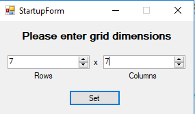
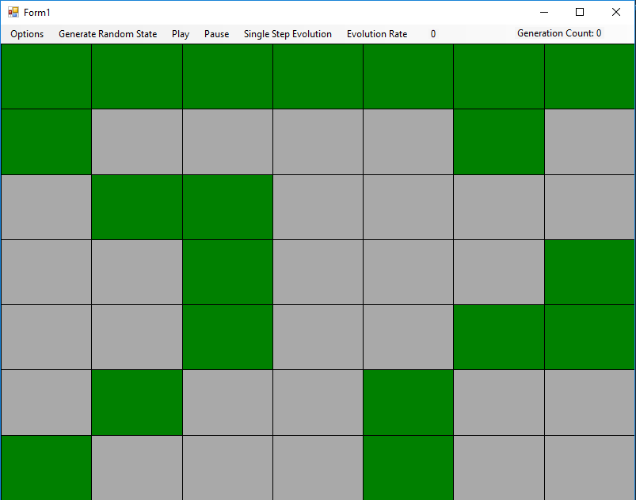
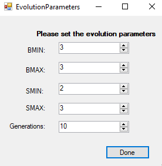
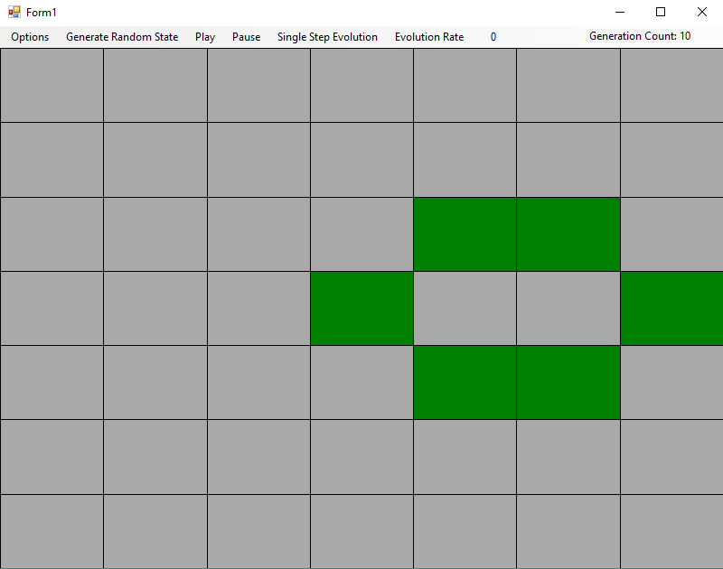
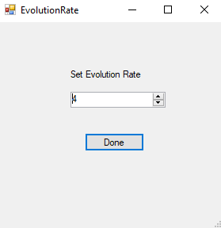

# GameOfLife

A GUI application that simulates Conway's Game of Life.

The universe of the Game of Life is an infinite two-dimensional orthogonal grid of square cells, each of which is in one of two possible states, alive or dead, or "populated" or "unpopulated". Every cell interacts with its eight neighbors, which are the cells that are horizontally, vertically, or diagonally adjacent. At each step in time, the following transitions occur:

Any live cell with fewer than two live neighbors dies, as if caused by underpopulation.
Any live cell with two or three live neighbors lives on to the next generation.
Any live cell with more than three live neighbors dies, as if by overpopulation.
Any dead cell with exactly three live neighbors becomes a live cell, as if by reproduction.
The initial pattern constitutes the seed of the system. The first generation is created by applying the above rules simultaneously to every cell in the seed—births and deaths occur simultaneously, and the discrete moment at which this happens is sometimes called a tick (in other words, each generation is a pure function of the preceding one). The rules continue to be applied repeatedly to create further generations.

## Getting Started

These instructions will get you a copy of the project up and running on your local machine for development and testing purposes.

### Prerequisites

```
Visual Studios
```

## Running the tests

Setting the Grid Size



Populate random states in grid



Setting parameters for evolution



Grid 10 Generations Later



Setting evolution rate



## Author

**Steven Duong**
